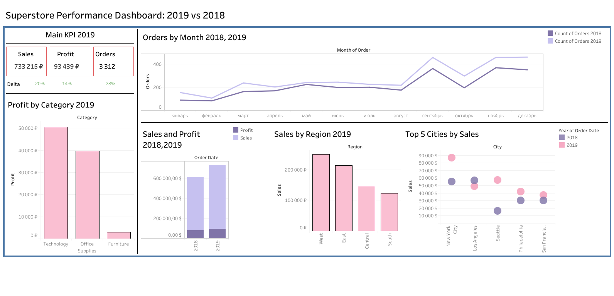

# Superstore Performance Dashboard: 2019 vs 2018



## Цель
Данный дашборд предназначен для анализа производительности компании Superstore за 2019 год по сравнению с 2018 годом. Он предоставляет ключевые показатели эффективности (KPI), тренды продаж и прибыли, а также детализированные данные по регионам и городам.

## Файл дашборда
Файл дашборда находится в папке `/dashboard/`  
[SuperstoreDashboard.twbx](./dashboard/SuperstoreDashboard.twbx)

## Опубликованный дашборд
Дашборд доступен для просмотра по следующей ссылке:  
[Superstore Performance Dashboard](https://public.tableau.com/views/SuperstoreDashboard_17479849536450/Dashboard1?:language=en-US&:sid=&:redirect=auth&:display_count=n&:origin=viz_share_link)

## Структура дашборда
1. **Основные KPI за 2019 год**
   - Продажи (Sales)
   - Прибыль (Profit)
   - Количество заказов (Orders)
   - Delta: Процентное изменение по сравнению с 2018 годом

2. **Заказы по месяцам 2018 и 2019**
   - График линий, показывающий ежемесячное количество заказов за 2018 и 2019 годы.

3. **Прибыль по категориям за 2019 год**
   - Столбчатая диаграмма, демонстрирующая прибыль по категориям товаров (Technology, Office Supplies, Furniture) за 2019 год.

4. **Продажи и прибыль 2018 и 2019**
   - Столбчатая диаграмма с наложением данных: Продажи (Sales) и Прибыль (Profit).

5. **Продажи по регионам 2019**
   - Горизонтальная столбчатая диаграмма, показывающая общие продажи по регионам (West, East, Central, South) за 2019 год.

6. **Топ-5 городов по продажам**
   - Точечная диаграмма, отображающая топ-5 городов по объему продаж за 2018 и 2019 годы.

## Используемые метрики и вычисления
1. **Основные KPI**
   - Sales 2019: SUM(Sales) за 2019 год.
   - Profit 2019: SUM(Profit) за 2019 год.
   - Orders 2019: COUNTD(Order ID) за 2019 год.
   - Delta: Процентное изменение между 2019 и 2018 годами:
     ```tableau
     ([Value 2019] - [Value 2018]) / ABS([Value 2018])
     ```

2. **Заказы по месяцам**
   - Count of Orders 2018: COUNTD(Order ID) за 2018 год, группированное по месяцам.
   - Count of Orders 2019: COUNTD(Order ID) за 2019 год, группированное по месяцам.

3. **Прибыль по категориям**
   - Profit by Category 2019: SUM(Profit) за 2019 год, группированное по категориям товаров.

4. **Продажи и прибыль 2018 и 2019**
   - Sales 2018/2019: SUM(Sales) за 2018 и 2019 годы.
   - Profit 2018/2019: SUM(Profit) за 2018 и 2019 годы.

5. **Продажи по регионам**
   - Sales by Region 2019: SUM(Sales) за 2019 год, группированное по регионам.

6. **Топ-5 городов по продажам**
   - Top 5 Cities by Sales: Топ-5 городов по продажам за 2018 и 2019 годы, отсортировано по убыванию продаж.

## Функциональность
1. **Фильтры**
   - Возможность фильтровать данные по году, региону, категории товаров и другим параметрам.
   - Добавление интерактивных фильтров для детального анализа.

2. **Интерактивность**
   - Кликабельные элементы для детализации данных.
   - Всплывающие подсказки (Tooltips) с точными значениями.

3. **Автоматизация**
   - Автоматическое обновление данных через Power Query или Tableau Data Extracts.
   - Периодическая публикация дашборда в Tableau Public или Power BI Service.
